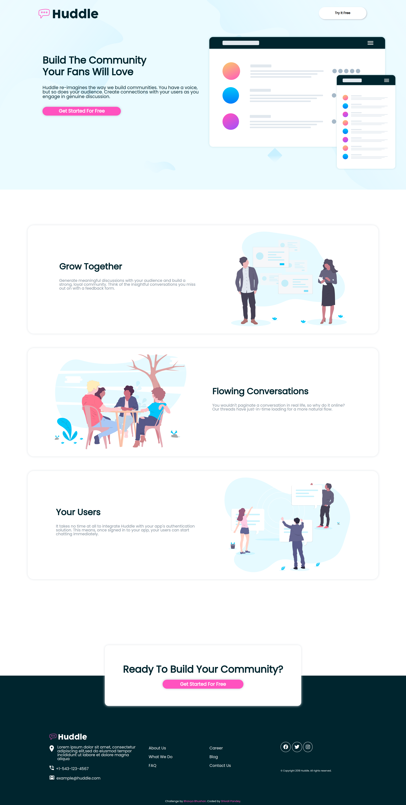

# Huddle Landing Page

## Table of contents

- [Overview](#overview)
  - [The challenge](#the-challenge)
  - [Screenshot](#screenshot)
  - [Links](#links)
- [My process](#my-process)
  - [Built with](#built-with)
  - [What I learned](#what-i-learned)
  - [Continued development](#continued-development)
  - [Useful resources](#useful-resources)

## Overview

### The challenge

Users should be able to:

- View the optimal layout for the site depending on their device's screen size
- See hover states for all interactive elements on the page

### Screenshot



### Links

- Live Site URL: [Huddle Project](https://epic-poitras-32f09d.netlify.app/)

## My process

### Built with

- Semantic HTML5 markup
- CSS custom properties
- Flexbox
- CSS Grid
- Netlify to deploy

### What I learned

This project helped me regain my confidence on HTML and CSS. While working on this project, I learned <code>flex</code> and <code>grid</code> properties in CSS. Aligning everything at place was easy using these properties. Also, I learned to complete things within the duration allotted.

Below is the code for the cards that I have used in the website.

```html
<div class="card-container">
  <div class="card">
    <div class="card-text">
      <h1>Grow Together</h1>
      <p>
        Generate meaningful discussions with your audience and build a strong,
        loyal community. Think of the insightful conversations you miss out on
        with a feedback form.
      </p>
    </div>

    <div class="card-image">
      
    </div>
  </div>

  <div class="card reverse">
    <div class="card-image">
      
    </div>

    <div class="card-text">
      <h1>Flowing Conversations</h1>
      <p>
        You wouldn't paginate a conversation in real life, so why do it online?
        Our threads have just-in-time loading for a more natural flow.
      </p>
    </div>
  </div>

  <div class="card">
    <div class="card-text">
      <h1>Your Users</h1>
      <p>
        It takes no time at all to integrate Huddle with your app's
        authentication solution. This means, once signed in to your app, your
        users can start chatting immediately.
      </p>
    </div>

    <div class="card-image">
      
    </div>
  </div>
</div>
```

```css
.boxshadow {
  box-shadow: 2px 2px 5px hsl(210, 14%, 78%);
}
.card-container {
  display: flex;
  flex-direction: column;
  align-content: space-between;
  justify-content: space-between;
  padding: 7% 5%;
}
.card {
  display: flex;
  flex-wrap: wrap;
  width: auto;
  flex-direction: row;
  align-items: center;
  justify-content: space-evenly;
  height: 40vh;
  margin: 0;
  margin: 2%;
  border-radius: 25px;
  box-shadow: 0px 0px 10px hsl(206, 13%, 89%);
}
.card-text {
  width: 40%;
}
.card-text > h1 {
  color: hsl(192, 100%, 9%);
  text-align: justify;
  font-size: 2.2rem;
}
.card-text > p {
  padding: 5% 0;
  color: hsl(208, 11%, 55%);
}

.card-image > img {
  height: 35vh;
}

}
```

### Continued development

Working towards making it responsive for bigger screen sizes and refining the stylesheets.

### Useful resources

- [A guide to flexbox](https://css-tricks.com/snippets/css/a-guide-to-flexbox/) - This helped me in learning CSS flexbox. I really liked this content and will use it going forward.
- [CSS best practices](https://code.tutsplus.com/tutorials/30-css-best-practices-for-beginners--net-6741) - This is an amazing article which helped me finally understand best practices in CSS. I'd recommend it to anyone still learning this concept.
